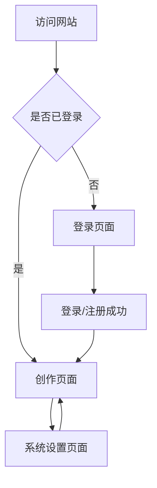

## 1. 产品概述
RedInk 是一个AI驱动的小红书创作助手，帮助用户快速生成优质的小红书内容。通过智能AI技术，用户可以轻松创作吸引人的标题、文案和标签，提升内容质量和创作效率。

目标用户为小红书内容创作者、品牌营销人员和个人用户，解决内容创作灵感不足、文案质量不高的问题。

## 2. 核心功能

### 2.1 用户角色
| 角色 | 注册方式 | 核心权限 |
|------|----------|----------|
| 普通用户 | 邮箱注册 | 使用基础AI创作功能，个人API密钥配置 |
| 高级用户 | 邀请码升级 | 无限制使用所有功能，优先体验新功能 |

### 2.2 功能模块
RedInk创作助手包含以下核心页面：
1. **创作页面**：AI文案生成、标题创作、标签推荐。
2. **系统设置页面**：全局API密钥配置、个人API密钥配置、用户偏好设置。
3. **登录页面**：用户登录和注册功能。

### 2.3 页面详情
| 页面名称 | 模块名称 | 功能描述 |
|----------|----------|----------|
| 创作页面 | AI文案生成 | 输入关键词生成小红书风格文案，支持多轮优化和风格调整 |
| 创作页面 | 标题创作 | 基于内容自动生成吸引人的标题，提供多种风格选择 |
| 创作页面 | 标签推荐 | 智能推荐相关热门标签，支持自定义添加和排序 |
| 系统设置页面 | 全局API密钥配置 | 设置系统默认的AI服务API密钥，影响所有用户 |
| 系统设置页面 | 个人API密钥配置 | 用户自定义个人API密钥，优先级高于全局配置 |
| 系统设置页面 | 用户偏好设置 | 保存用户创作偏好、历史记录等个性化设置 |
| 登录页面 | 用户登录 | 邮箱密码登录，支持记住登录状态 |
| 登录页面 | 用户注册 | 新用户注册账号，包含邮箱验证流程 |

## 3. 核心流程
用户访问流程：未登录用户自动重定向到登录页面 → 登录/注册成功后进入创作页面 → 可随时访问系统设置页面配置API密钥。

## 4. 用户界面设计

### 4.1 设计风格
- **主色调**：小红书品牌红色 (#FF2442) 搭配白色背景
- **辅助色**：深灰色 (#333333) 用于文字，浅灰色 (#F5F5F5) 用于背景
- **按钮样式**：圆角矩形设计，主按钮使用品牌红色，次要按钮使用边框样式
- **字体**：优先使用系统默认字体，标题使用加粗样式
- **布局风格**：卡片式布局，内容居中显示，顶部导航栏固定
- **图标风格**：使用简洁的线性图标，与小红书设计风格保持一致

### 4.2 页面设计概述
| 页面名称 | 模块名称 | UI元素 |
|----------|----------|--------|
| 创作页面 | AI文案生成 | 大型文本输入框占据主要空间，生成按钮突出显示，结果展示区域清晰分隔 |
| 创作页面 | 标题创作 | 简洁的输入输出对比布局，支持一键复制功能 |
| 创作页面 | 标签推荐 | 标签云形式展示，支持拖拽排序和批量操作 |
| 系统设置页面 | 全局API密钥配置 | 独立卡片区域，醒目的标题区分，表单字段清晰标注 |
| 系统设置页面 | 个人API密钥配置 | 与全局配置视觉区分，使用不同背景色或边框样式 |
| 登录页面 | 用户登录/注册 | 居中卡片布局，简洁的表单设计，无额外按钮干扰 |

### 4.3 响应式设计
采用桌面端优先设计，适配移动端显示。所有页面在底部统一显示版权信息：
- AI驱动的小红书创作助手
- © 2025 RedInk by 默子 (Histone) Licensed under CC BY-NC-SA 4.0

页面底部固定显示版权信息，确保在所有页面都能清晰展示。