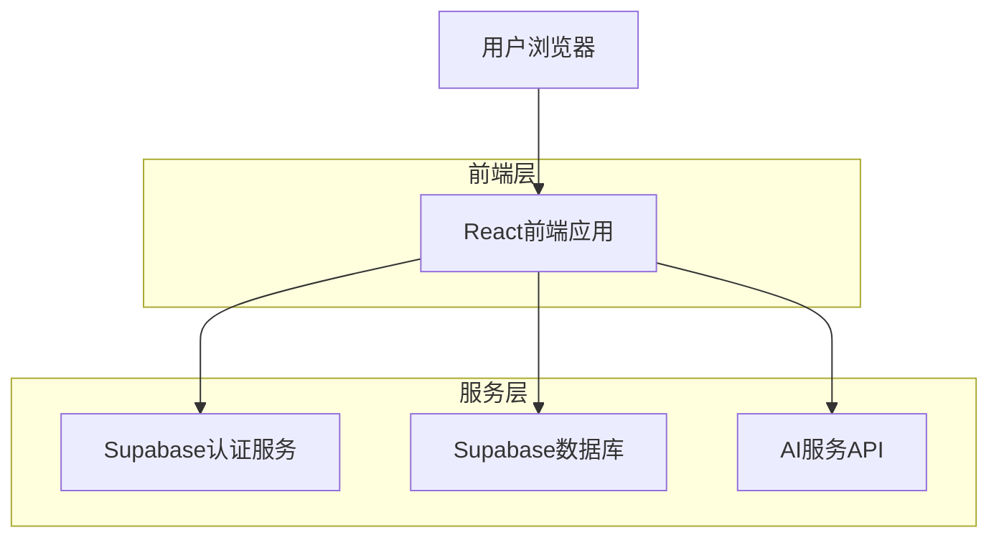
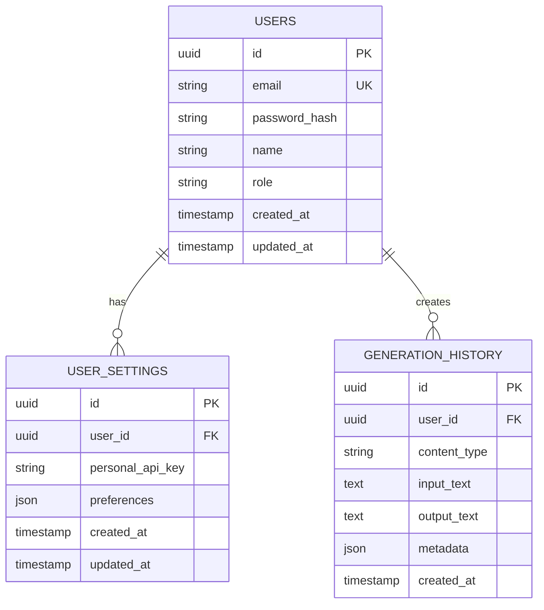

## 1. 架构设计



## 2. 技术描述
- **前端**：React@18 + tailwindcss@3 + vite
- **初始化工具**：vite-init
- **后端**：Supabase（认证、数据库、存储）
- **AI服务**：外部API集成（OpenAI/其他AI服务）

## 3. 路由定义
| 路由 | 用途 |
|------|------|
| / | 创作页面，主要功能页面 |
| /login | 登录页面，用户认证入口 |
| /register | 注册页面，新用户注册 |
| /settings | 系统设置页面，API密钥配置 |

## 4. 认证流程
### 4.1 路由保护
- 所有需要认证的页面都会检查用户登录状态
- 未登录用户自动重定向到 `/login`
- 登录成功后跳转回原访问页面

### 4.2 核心认证API
```
POST /api/auth/login
```

请求参数：
| 参数名 | 参数类型 | 是否必需 | 描述 |
|--------|----------|----------|------|
| email | string | true | 用户邮箱 |
| password | string | true | 用户密码 |

响应参数：
| 参数名 | 参数类型 | 描述 |
|--------|----------|------|
| user | object | 用户信息 |
| session | object | 会话令牌 |

示例：
```json
{
  "email": "user@example.com",
  "password": "password123"
}
```

## 5. 数据模型

### 5.1 数据模型定义


### 5.2 数据定义语言
用户表 (users)
```sql
-- 创建用户表
CREATE TABLE users (
  id UUID PRIMARY KEY DEFAULT gen_random_uuid(),
  email VARCHAR(255) UNIQUE NOT NULL,
  password_hash VARCHAR(255) NOT NULL,
  name VARCHAR(100) NOT NULL,
  role VARCHAR(20) DEFAULT 'user' CHECK (role IN ('user', 'admin')),
  created_at TIMESTAMP WITH TIME ZONE DEFAULT NOW(),
  updated_at TIMESTAMP WITH TIME ZONE DEFAULT NOW()
);

-- 创建用户设置表
CREATE TABLE user_settings (
  id UUID PRIMARY KEY DEFAULT gen_random_uuid(),
  user_id UUID REFERENCES users(id) ON DELETE CASCADE,
  personal_api_key VARCHAR(255),
  preferences JSONB DEFAULT '{}',
  created_at TIMESTAMP WITH TIME ZONE DEFAULT NOW(),
  updated_at TIMESTAMP WITH TIME ZONE DEFAULT NOW()
);

-- 创建生成历史表
CREATE TABLE generation_history (
  id UUID PRIMARY KEY DEFAULT gen_random_uuid(),
  user_id UUID REFERENCES users(id) ON DELETE CASCADE,
  content_type VARCHAR(50) NOT NULL,
  input_text TEXT NOT NULL,
  output_text TEXT NOT NULL,
  metadata JSONB DEFAULT '{}',
  created_at TIMESTAMP WITH TIME ZONE DEFAULT NOW()
);

-- 创建索引
CREATE INDEX idx_users_email ON users(email);
CREATE INDEX idx_user_settings_user_id ON user_settings(user_id);
CREATE INDEX idx_generation_history_user_id ON generation_history(user_id);
CREATE INDEX idx_generation_history_created_at ON generation_history(created_at DESC);

-- 设置权限
GRANT SELECT ON users TO anon;
GRANT ALL PRIVILEGES ON users TO authenticated;
GRANT SELECT ON user_settings TO anon;
GRANT ALL PRIVILEGES ON user_settings TO authenticated;
GRANT SELECT ON generation_history TO anon;
GRANT ALL PRIVILEGES ON generation_history TO authenticated;
```

## 6. 前端状态管理
- 使用React Context管理全局认证状态
- 使用localStorage存储用户登录状态和偏好设置
- 路由守卫组件实现自动重定向逻辑

## 7. API密钥管理
- 全局API密钥：存储在系统配置中，所有用户共享
- 个人API密钥：存储在用户设置中，优先级高于全局配置
- 密钥验证：前端验证格式，后端验证有效性